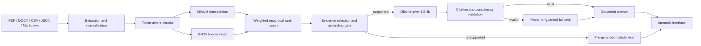

# Finance Knowledge RAG

A fully local Retrieval-Augmented Generation system for synthetic finance and FP&A documentation.

The project combines multiformat ingestion, token-aware chunking, MiniLM embeddings, BM25 lexical retrieval, weighted reciprocal rank fusion, local generation with Ollama, verified citations and safe abstention. It was designed as an end-to-end Data Science portfolio project rather than a chatbot prototype.

> **Language:** [English](README.md) · [Español](README_ES.md)

## Project snapshot

| Area | Result |
|---|---:|
| Source formats | PDF, DOCX, CSV, JSON and Markdown |
| Extracted records | 305 |
| Token-aware chunks | 316 |
| Embedding matrix | 316 × 384, `float32`, L2-normalised |
| Local generation model | `qwen3.5:4b` through Ollama |
| External API usage | None |
| Supported benchmark questions | 30 |
| Unsupported benchmark questions | 10 |
| Supported questions answered | 30 / 30 |
| Unsupported questions correctly rejected | 10 / 10 |
| Valid citation rate | 100% |
| Expected evidence retrieved, sent and cited | 100% / 100% / 100% |
| Mean grounded-claim rate | 95.44% |
| Automatic failures | 0 |
| Final manual outcome | 29 accepted, 1 conservative partial |

## Why this project

Finance teams often work across management reports, policy documents, KPI dictionaries, monthly actuals and forecast meeting notes. The same business question may require evidence from structured and unstructured files, while incorrect numbers or unsupported answers can create material risk.

This project addresses that problem with four design goals:

1. **Local-first operation** — no paid API and no external token usage.
2. **Evidence before generation** — the model only receives selected finance evidence.
3. **Traceable answers** — every supported answer must contain validated citations.
4. **Safe failure** — unsupported questions are rejected before model generation.

## Architecture



The Streamlit application is only a presentation layer. Retrieval, evidence selection, generation, citation validation, fallback and abstention remain in the evaluated Generation v5.3 pipeline.

## Retrieval design

### Dense baseline

The baseline retriever uses normalised MiniLM embeddings and cosine similarity.

### Hybrid retriever

The selected configuration combines dense and lexical retrieval through weighted reciprocal rank fusion:

```text
dense_weight   = 0.20
lexical_weight = 0.80
rrf_k          = 10
BM25 k1        = 1.5
BM25 b         = 0.75
```

The parameters were selected on a separate 10-question development set. The frozen 30-question formal benchmark was not used for tuning.

### Formal retrieval results

| Metric | Dense baseline | Hybrid | Change |
|---|---:|---:|---:|
| MRR | 0.7117 | **0.8107** | +0.0990 |
| Hit@1 | 66.67% | **76.67%** | +10.00 pp |
| Hit@5 | 73.33% | **90.00%** | +16.67 pp |
| Mean rank | 18.30 | **3.97** | -14.33 |

With metadata filters, the hybrid retriever reached **0.9031 MRR** and **96.67% Hit@5**.

## Grounded generation and safety

Generation v5.3 applies several safeguards:

- only selected evidence is sent to the model;
- citations are numbered and validated against the supplied context;
- missing or invented citations trigger repair or fallback;
- financial polarity and numeric consistency checks detect contradictions;
- unsupported metric requests are rejected before Ollama is called;
- a guarded extractive fallback is available when evidence is sufficient but the generated answer does not pass validation.

The final generation benchmark produced:

| Metric | Result |
|---|---:|
| Supported questions answered | **30 / 30** |
| Unexpected abstentions | **0** |
| Expected chunk retrieved | **100%** |
| Expected chunk sent to model | **100%** |
| Expected chunk cited | **100%** |
| Valid citation rate | **100%** |
| Mean semantic similarity | **0.8617** |
| Mean reference-token recall | **0.8311** |
| Mean numeric-fact recall | **0.9627** |
| Mean grounded-claim rate | **0.9544** |
| Automatic quality flags | **23 pass, 7 review, 0 fail** |
| Unsupported questions correctly rejected | **10 / 10** |
| False answers on unsupported questions | **0** |

Manual review accepted 29 supported answers and classified one as a conservative partial answer because it omitted part of the requested operational explanation without inventing information.

## Local interface

The Streamlit application provides:

- chat-based questioning;
- formally evaluated defaults (`top_k=5`, no metadata filters);
- optional file type, granularity and document filters;
- numbered citations and source metadata;
- generation mode, model and latency;
- technical evidence context;
- clear abstention and fallback states.

### Example supported question

```text
A capital expenditure project is expected to cost AUD 300,000.
Who must approve it, and what supporting documentation is required?
```

### Example unsupported question

```text
What effective corporate tax rate was forecast for Harbour Retail Group for FY2025/26?
```

The supported question produces a grounded, cited answer. The unsupported question is rejected before Ollama is called.

## Quick start

### 1. Create the environment

```powershell
conda env create -f environment.yml
conda activate finance-rag
python -m pip install -r requirements.txt
```

### 2. Install and verify Ollama

Install Ollama separately, then pull the evaluated model:

```powershell
ollama pull qwen3.5:4b
ollama list
```

See [`docs/local_ollama_setup.md`](docs/local_ollama_setup.md) for the full local setup.

### 3. Validate the final system

```powershell
python tests\validate_generation_improvements.py
python tests\validate_ollama_rag.py
python tests\validate_streamlit_interface.py
python tests\validate_documentation.py
```

### 4. Run the interface

```powershell
streamlit run app.py
```

Open `http://localhost:8501` if the browser does not open automatically.

## Reproduce the evaluation

The repository contains the frozen formal datasets and generated reports.

```powershell
python tests\evaluate_formal_baseline.py
python tests\evaluate_formal_hybrid.py
python tests\evaluate_formal_generation.py
```

Generation evaluation requires Ollama and `qwen3.5:4b`. The raw checkpoint allows interrupted runs to continue.

## Repository guide

```text
app.py                         Streamlit interface
config/                        Frozen hybrid retriever configuration
data/blueprint/                Synthetic corpus specification
data/raw/                      Generated source documents
data/processed/                Records, chunks and embedding metadata
docs/                          Setup, architecture, methodology and demo guides
reports/                       Retriever and generation evaluation outputs
src/                           Corpus, retrieval, grounding and generation code
tests/                         Validation, tuning and formal evaluation scripts
```

## Documentation

- [Technical architecture](docs/architecture.md)
- [Methodology and design decisions](docs/methodology.md)
- [Formal evaluation](docs/evaluation.md)
- [Local interface guide](docs/local_interface.md)
- [Demo guide](docs/demo_guide.md)
- [Spanish presentation guide](docs/presentation_guide_es.md)
- [Environment setup](docs/environment_setup.md)
- [Local Ollama setup](docs/local_ollama_setup.md)

## Limitations

- The corpus is synthetic and intentionally small; production behaviour would depend on source quality, access controls and document lifecycle management.
- The formal generation benchmark contains 40 questions, so the results should not be interpreted as universal performance guarantees.
- CPU generation is functional but slow: the final benchmark median was about 21.5 seconds.
- Question wording can affect the grounding gate when a request is ambiguous.
- One net-working-capital answer was correct but only partially complete.
- The local 4B model is weaker than larger hosted models, although the safety layer reduces unsupported answers.
- Metadata filters and non-default `top_k` values are available for exploration but were not part of the frozen end-to-end evaluation.

## Project status

The evaluated version is frozen as **Generation v5.3**. Further benchmark-specific tuning was deliberately stopped to avoid overfitting.

## Licence

See [`LICENSE`](LICENSE).
