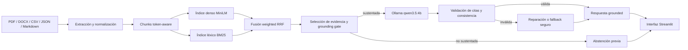

# Finance Knowledge RAG

Sistema RAG completamente local para documentación financiera y de FP&A, construido como proyecto end-to-end de Data Science.

El proyecto combina ingestión multiformato, chunking token-aware, embeddings MiniLM, recuperación léxica BM25, weighted reciprocal rank fusion, generación local con Ollama, citas verificadas y abstención segura.

> **Idioma:** [English](README.md) · [Español](README_ES.md)

## Resumen del proyecto

| Área | Resultado |
|---|---:|
| Formatos | PDF, DOCX, CSV, JSON y Markdown |
| Registros extraídos | 305 |
| Chunks token-aware | 316 |
| Embeddings | matriz 316 × 384, `float32`, normalizada |
| Modelo local | `qwen3.5:4b` mediante Ollama |
| API externa | Ninguna |
| Preguntas sustentadas | 30 |
| Preguntas no sustentadas | 10 |
| Preguntas sustentadas respondidas | 30 / 30 |
| Abstenciones correctas | 10 / 10 |
| Citas válidas | 100% |
| Evidencia esperada recuperada, enviada y citada | 100% / 100% / 100% |
| Groundedness medio | 95,44% |
| Fallos automáticos | 0 |
| Revisión final | 29 aceptadas y 1 parcial conservadora |

## Problema que resuelve

En finanzas, una pregunta puede requerir combinar datos de actuals, forecast, políticas, KPIs y actas de reuniones. El riesgo no está solo en recuperar un documento incorrecto, sino también en:

- mezclar cifras de periodos distintos;
- invertir la interpretación favorable/desfavorable;
- citar una fuente que no respalda la respuesta;
- responder aunque el corpus no contenga la información.

El sistema se diseñó con cuatro objetivos:

1. funcionar en local y sin costes de API;
2. entregar al modelo únicamente evidencia seleccionada;
3. producir respuestas trazables con citas verificadas;
4. abstenerse antes de generar cuando no existe soporte suficiente.

## Arquitectura



## Resultados del retriever

La configuración híbrida final es:

```text
dense_weight   = 0.20
lexical_weight = 0.80
rrf_k          = 10
BM25 k1        = 1.5
BM25 b         = 0.75
```

Los parámetros se eligieron con un conjunto de desarrollo independiente de 10 preguntas. El benchmark formal de 30 preguntas no se utilizó para tuning.

| Métrica | Dense baseline | Híbrido |
|---|---:|---:|
| MRR | 0,7117 | **0,8107** |
| Hit@1 | 66,67% | **76,67%** |
| Hit@5 | 73,33% | **90,00%** |
| Rango medio | 18,30 | **3,97** |

## Resultados end-to-end

| Métrica | Resultado |
|---|---:|
| Preguntas sustentadas respondidas | **30 / 30** |
| Abstenciones inesperadas | **0** |
| Chunk esperado recuperado | **100%** |
| Chunk esperado enviado al modelo | **100%** |
| Chunk esperado citado | **100%** |
| Citas válidas | **100%** |
| Similitud semántica media | **0,8617** |
| Cobertura numérica | **96,27%** |
| Groundedness medio | **95,44%** |
| Flags automáticos | **23 pass, 7 review, 0 fail** |
| Preguntas no sustentadas rechazadas | **10 / 10** |
| Respuestas falsas | **0** |

La revisión manual aceptó 29 respuestas y clasificó una como parcial porque omitía parte de la explicación solicitada, sin inventar información.

## Ejecutar el proyecto

```powershell
conda env create -f environment.yml
conda activate finance-rag
python -m pip install -r requirements.txt

ollama pull qwen3.5:4b
streamlit run app.py
```

La interfaz se abre normalmente en `http://localhost:8501`.

## Validaciones finales

```powershell
python tests\validate_generation_improvements.py
python tests\validate_ollama_rag.py
python tests\validate_streamlit_interface.py
python tests\validate_documentation.py
```

## Documentación

- [Arquitectura técnica](docs/architecture.md)
- [Metodología y decisiones de diseño](docs/methodology.md)
- [Evaluación formal](docs/evaluation.md)
- [Guía de la interfaz](docs/local_interface.md)
- [Guía de demostración](docs/demo_guide.md)
- [Guía para presentar el proyecto](docs/presentation_guide_es.md)

## Limitaciones

- El corpus es sintético y de tamaño reducido.
- El benchmark formal incluye 40 preguntas y no representa todos los posibles usos.
- La generación local en CPU es segura pero lenta.
- La redacción de preguntas ambiguas puede afectar al grounding gate.
- Una respuesta sobre net working capital quedó parcialmente completa.
- Los filtros y cambios de `top_k` no forman parte de la configuración end-to-end congelada.

## Estado

La versión final evaluada es **Generation v5.3**. Se evitó seguir ajustando reglas específicas al benchmark para reducir el riesgo de sobreajuste.
