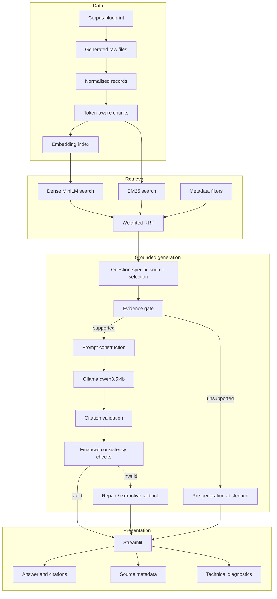

# Technical architecture

## Design principles

The system was built around five principles:

1. **Local-first:** embeddings, retrieval, generation and interface run locally.
2. **Separation of concerns:** ingestion, retrieval, grounding, generation and presentation are independent layers.
3. **Evidence gating:** retrieval success alone is not sufficient; selected evidence must also satisfy the query.
4. **Traceability:** every supported answer exposes source metadata and validated citation numbers.
5. **Safe degradation:** invalid model output is repaired, replaced by a guarded fallback or rejected.

## Component view

## Data layer

The corpus is generated from a controlled blueprint and exported to five formats:

- management report in PDF;
- policies and procedures in DOCX;
- monthly budget-versus-actual data in CSV;
- KPI dictionary in JSON;
- forecast meeting notes in Markdown.

Extraction converts the files into a common record schema. Token-aware chunking then creates retrieval units while preserving file-specific metadata such as page, section, period, department and granularity.

## Embedding layer

`sentence-transformers` produces 384-dimensional MiniLM embeddings. The vectors are stored as `float32` and normalised so dense similarity can use the dot product as cosine similarity.

## Retrieval layer

The hybrid retriever creates:

- a dense ranking from the embedding index;
- a lexical BM25 ranking over `retrieval_text`;
- a fused ranking through weighted reciprocal rank fusion.

The selected lexical-heavy weighting reflects the corpus: finance questions often contain exact entity names, months, KPI labels, thresholds and policy terms that benefit from lexical matching.

Metadata filters are available, but the frozen end-to-end evaluation uses global retrieval without filters.

## Grounding layer

The grounding layer performs more than top-k retrieval:

1. identifies question intent and requested facts;
2. prioritises candidate sources;
3. selects the evidence units supplied to the model;
4. rejects unsupported requests before generation;
5. preserves contiguous citation numbering.

This layer prevents the local model from seeing irrelevant corpus content.

## Generation and validation

Ollama receives:

- the user question;
- explicit grounded-answer rules;
- only the selected numbered evidence.

The output is checked for:

- citation presence and validity;
- sentence-level citation coverage;
- numeric completeness;
- expense and forecast polarity;
- zero-variance wording;
- approval completeness;
- requested difference completeness;
- context-dependent KPI explanations.

If the output fails, the pipeline may retry with a repair prompt. If sufficient evidence exists but model output remains invalid, a guarded extractive fallback is used. If the evidence is insufficient, the system abstains.

## Interface layer

`app.py` calls the evaluated `OllamaGroundedRAG` class directly. It does not reimplement the RAG logic.

The interface exposes:

- answer;
- citation list;
- generation mode;
- model;
- wall time;
- provider metrics;
- selected model context.

## Security and production considerations

The current project is a local portfolio implementation. A production deployment would additionally need:

- document-level access control;
- user authentication and audit logs;
- encrypted storage;
- source freshness and document lifecycle controls;
- PII and confidential-data handling;
- monitoring for retrieval drift;
- benchmark expansion with real domain users.
